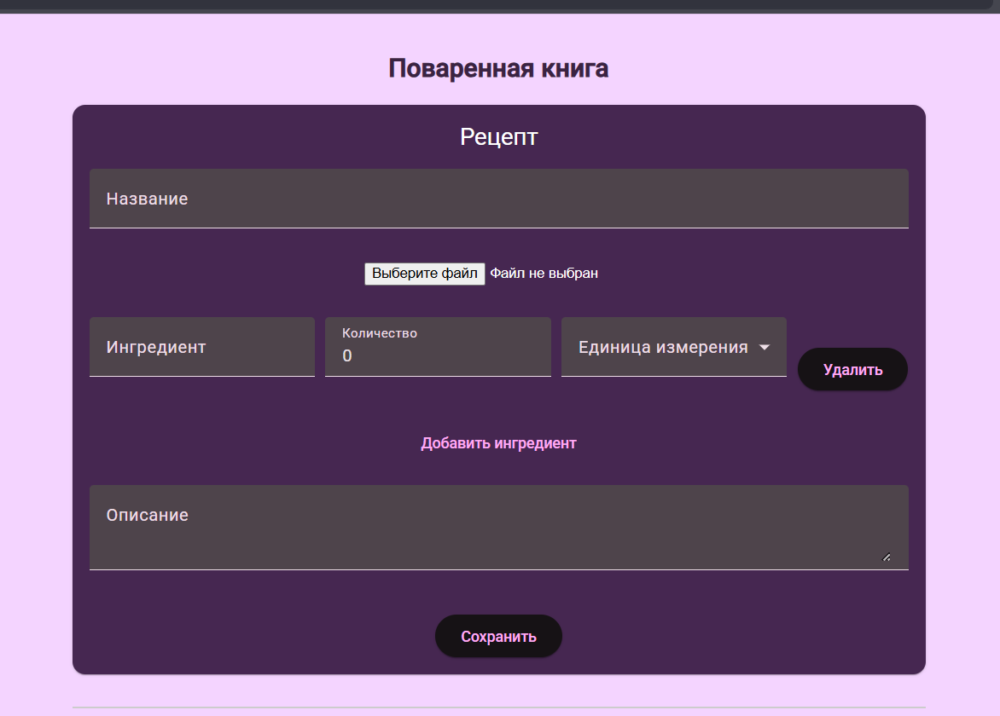

# Cookbook

This project was generated using [Angular CLI](https://github.com/angular/angular-cli) version 19.1.7.

## Development server

To start a local development server, run:

```bash
ng serve
```

Once the server is running, open your browser and navigate to `http://localhost:4200/`. The application will automatically reload whenever you modify any of the source files.

## How it looks?




